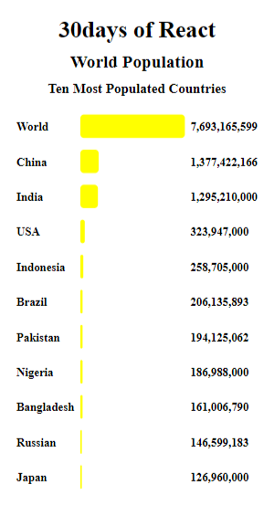

# 30days of React- day 07 

This is a solution to the [30 days of React day 7](https://github.com/Asabeneh/30-Days-Of-React/blob/master/07_Day_Class_Components/07_class_components.md). This exercise challenges help you improve your react coding skills by building projects.

## Table of contents

- [Overview](#overview)
  - [The challenge](#the-challenge)
  - [Screenshot](#screenshot)
  - [Links](#links)
- [My process](#my-process)
  - [Built with](#built-with)
  - [Proud of this](#proud-of-this)
  - [Continued development](#continued-development)
- [Author](#author)

## Overview

### The challenge

Users should be able to:

- View the optimal layout for the site depending on their device's screen size

### Screenshot





### Links

- Solution URL: (https://github.com/ibimina/world-poulation-class)
- Live Site URL: (https://ibimina.github.io/world-poulation-class/)

## My process

### Built with

- Create react app
-  created and export Header class component 
- created and export Main class component store array data using props
- created and export Country class component using props to map out array data
- Rendered App component
- CSS custom properties
- Flexbox
- CSS Grid
- Mobile-first workflow

### Proud of this

I used this class component to  pass the given given array in the app js to the country js

```jsx
class Main extends React.Component {
//   state = {};
  render() {
    return (
      <ul>
        {/* <div className="country">{this.props.country}</div>
        <div className="length">{this.props.showLength}</div>
        <div className="population"> {this.props.population}</div> */}
        <Country count={this.props.tenHighestPopulation} />
      </ul>
    );
  }
}

```

### Continued development

React framework


## Author

- Ibimina Hart
 - Frontend Mentor - [ibimina](https://www.frontendmentor.io/profile/ibimina)
 - Linkedin - [ibimina hart](https://www.linkedin.com/in/ibimina-hart)
- Twitter - [ibiminaaH](https://www.twitter.com/ibiminaaH)
